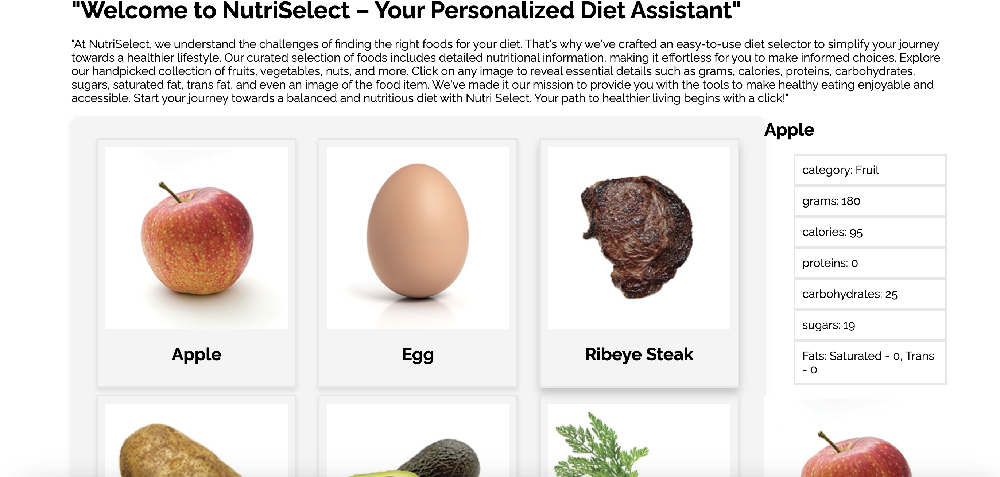

# NutriSelect!

## Description
NutriSelect is a web page that allows the user to pick from a variety of food items, and have information displayed about that food. When  food is selected, a side menu appears, showing the details and nutrition facts of that specific food item. This way, users can learn more about the nutrition of certain foods. This was made using an Object-Oriented programming approach, using Parcel.js Javascript bundling, as well as making use of Javascript modules. 

## Credits 
Dev Pandya & Aiden Wotton

## License
MIT 